# Database Schema Diagram

## Entity Relationship Diagram

```mermaid
erDiagram
    User ||--o{ TaskAssignment : "assigns"
    User ||--o{ Task : "creates"
    User ||--o{ Contract : "creates"
    User {
        string id
        string email
        string name
        string password
        string role
        string avatar
        boolean isActive
        datetime createdAt
        datetime updatedAt
    }

    Customer ||--o{ ServicePlan : "has"
    Customer ||--o{ Task : "owns"
    Customer ||--o{ Communication : "has"
    Customer ||--o{ Contract : "receives"
    Customer ||--o{ Plan : "has"
    Customer {
        string id
        string email
        string name
        string phone
        string company
        string address
        string city
        string country
        string industry
        string size
        string status
        string notes
        datetime createdAt
        datetime updatedAt
    }

    ServicePlan ||--o{ Task : "includes"
    ServicePlan ||--o{ PlanKPI : "has"
    ServicePlan ||--o| PlanPricing : "has"
    ServicePlan ||--o{ Assignment : "has"
    ServicePlan {
        string id
        string name
        string description
        string type
        string status
        decimal price
        string currency
        int duration
        json features
        json erpConnection
        string dataDomains
        json governancePolicy
        string customerId
        datetime createdAt
        datetime updatedAt
    }

    Task ||--o{ TaskAssignment : "assigned_to"
    Task ||--o{ Plan : "has"
    Task {
        string id
        string title
        string description
        string type
        string priority
        string status
        decimal budget
        decimal actualCost
        datetime dueDate
        datetime completedAt
        int estimatedHours
        int actualHours
        string customerId
        string servicePlanId
        string createdById
        string updatedById
        datetime createdAt
        datetime updatedAt
    }

    TaskAssignment {
        string id
        string taskId
        string userId
        string status
        string notes
        datetime assignedAt
    }

    Partner ||--o{ Assignment : "receives"
    Partner {
        string id
        string name
        string email
        string phone
        string country
        string city
        string address
        float latitude
        float longitude
        string domain
        string role
        json specialties
        float rating
        int activeEngagements
        string availability
        boolean remoteOk
        string notes
        datetime createdAt
        datetime updatedAt
    }

    Communication {
        string id
        string customerId
        string type
        string subject
        string content
        string direction
        datetime createdAt
    }

    CompanyProfile ||--o{ Contract : "sends"
    ContractTemplate ||--o{ Contract : "uses"
    CompanyProfile {
        string id
        string name
        string brand
        string legalName
        string email
        string phone
        string address
        string city
        string country
        string logoUrl
        string signerName
        string signerTitle
        datetime createdAt
        datetime updatedAt
    }

    ContractTemplate {
        string id
        string name
        string type
        string language
        string industry
        string brand
        string defaultContent
        json variables
        boolean isActive
        datetime createdAt
        datetime updatedAt
    }

    Contract {
        string id
        string type
        string status
        string language
        string industry
        json variables
        string generatedContent
        string pdfPath
        string aiProvider
        datetime sentAt
        datetime signedAt
        string templateId
        string senderCompanyId
        string customerId
        string recipientEmail
        string recipientName
        string createdById
        datetime createdAt
        datetime updatedAt
    }

    Plan ||--o{ Milestone : "has"
    Plan ||--o{ Resource : "has"
    Plan ||--o{ Service : "has"
    Plan ||--o{ Attachment : "has"
    Plan {
        string id
        string name
        string description
        string customerId
        string taskId
        string industry
        string companySize
        string durationType
        int durationWeeks
        datetime startDate
        int workingDays
        string address
        string siteType
        string accessRequirements
        string status
        int currentStage
        int totalStages
        decimal totalBudget
        string currency
        string notes
        datetime createdAt
        datetime updatedAt
    }

    Milestone {
        string id
        string planId
        int sequence
        string name
        string description
        int durationWeeks
        decimal budgetAllocation
        string deliverables
        string dependencies
        boolean isCriticalPath
        string status
        datetime startDate
        datetime completedDate
        decimal actualCost
        datetime createdAt
        datetime updatedAt
    }

    Resource {
        string id
        string planId
        string name
        string type
        int quantity
        decimal cost
        string currency
        string description
        datetime createdAt
        datetime updatedAt
    }

    Service {
        string id
        string planId
        string name
        string description
        int quantity
        decimal price
        string currency
        datetime createdAt
        datetime updatedAt
    }

    Attachment {
        string id
        string planId
        string name
        string type
        int size
        string url
        string description
        datetime createdAt
        datetime updatedAt
    }

    PlanKPI {
        string id
        string servicePlanId
        string kpiName
        float targetValue
        float thresholdGreen
        float thresholdAmber
        float thresholdRed
        float weight
        string calculationSource
        datetime effectiveFrom
        datetime effectiveTo
        float actualValue
        string status
        datetime createdAt
        datetime updatedAt
    }

    PlanPricing {
        string id
        string servicePlanId
        string package
        string addOns
        float basePrice
        float totalPrice
        float platformCommissionPct
        float partnerCommissionPct
        int payoutDelayDays
        string refundPolicy
        datetime contractStartDate
        datetime contractEndDate
        string paymentTerms
        boolean proposalGenerated
        string proposalPath
        datetime createdAt
        datetime updatedAt
    }

    Assignment {
        string id
        string servicePlanId
        string partnerId
        string type
        string assignmentOwner
        int slaHours
        datetime dueDate
        string priority
        string status
        string notes
        string attachments
        boolean notifyPartner
        datetime createdAt
        datetime updatedAt
    }

    Setting {
        string id
        string key
        string value
        string type
        string description
    }
```



## Key Enums

### UserRole
- `ADMIN` - Full system access
- `MANAGER` - Management level access
- `AGENT` - Agent level access
- `VIEWER` - Read-only access

### CustomerStatus
- `ACTIVE` - Active customer
- `INACTIVE` - Inactive customer
- `SUSPENDED` - Suspended account
- `PROSPECT` - Potential customer

### CompanySize
- `STARTUP` - Startup company
- `SMALL` - Small business
- `MEDIUM` - Medium business
- `LARGE` - Large enterprise
- `ENTERPRISE` - Enterprise level

### ServiceType
- `BASIC_CFO` - Basic CFO services
- `PREMIUM_CFO` - Premium CFO services
- `ENTERPRISE_CFO` - Enterprise CFO services
- `CONSULTING` - Consulting services
- `AUDIT` - Audit services
- `TAX_FILING` - Tax filing services
- `CUSTOM` - Custom services

### ServiceStatus
- `ACTIVE` - Active plan
- `INACTIVE` - Inactive plan
- `SUSPENDED` - Suspended plan
- `COMPLETED` - Completed plan

### TaskType
- `FINANCIAL_REVIEW` - Financial review task
- `TAX_PREPARATION` - Tax preparation
- `BUDGET_PLANNING` - Budget planning
- `AUDIT_SUPPORT` - Audit support
- `COMPLIANCE_CHECK` - Compliance check
- `REPORTING` - Reporting task
- `CONSULTATION` - Consultation
- `OTHER` - Other task types

### TaskStatus
- `PENDING` - Not started
- `IN_PROGRESS` - In progress
- `COMPLETED` - Completed
- `CANCELLED` - Cancelled
- `ON_HOLD` - On hold

### Priority
- `LOW` - Low priority
- `MEDIUM` - Medium priority
- `HIGH` - High priority
- `URGENT` - Urgent priority

### PartnerRole
- `ERP_CONSULTANT` - ERP consultant
- `TECHNICAL` - Technical role
- `ACCOUNTS` - Accounts role
- `STOCK_COUNT` - Stock counting
- `IMPLEMENTATION` - Implementation
- `TRAINING` - Training role
- `OTHER` - Other roles

### PartnerAvailability
- `AVAILABLE` - Available within 24 hours
- `MODERATE` - Available within 48 hours
- `BUSY` - Available within 72 hours
- `UNAVAILABLE` - Not available

### ContractType
- `SERVICE_AGREEMENT` - Service agreement
- `NDA` - Non-disclosure agreement
- `MSA` - Master service agreement
- `SOW` - Statement of work
- `PROPOSAL` - Proposal document
- `CUSTOM` - Custom contract

### ContractStatus
- `DRAFT` - Draft state
- `GENERATED` - Generated but not sent
- `SENT` - Sent to recipient
- `VIEWED` - Viewed by recipient
- `SIGNED` - Signed by recipient
- `FAILED` - Failed generation/sending

### PlanStatus
- `DRAFT` - Draft plan
- `ACTIVE` - Active plan
- `ON_HOLD` - Plan on hold
- `COMPLETED` - Completed plan
- `CANCELLED` - Cancelled plan

### MilestoneStatus
- `PENDING` - Not started
- `IN_PROGRESS` - In progress
- `COMPLETED` - Completed
- `DELAYED` - Delayed
- `CANCELLED` - Cancelled

### ResourceType
- `HUMAN_RESOURCE` - Human resources
- `EQUIPMENT` - Equipment
- `SOFTWARE` - Software
- `MATERIAL` - Materials
- `OTHER` - Other resources

## Database Statistics

### Core Entities: 7
- User
- Customer
- ServicePlan
- Task
- Partner
- Communication
- Setting

### Plan Builder Entities: 6
- Plan
- Milestone
- Resource
- Service
- Attachment
- PlanKPI

### Contract Management Entities: 3
- CompanyProfile
- ContractTemplate
- Contract

### Supporting Entities: 3
- TaskAssignment
- PlanPricing
- Assignment

### Total Tables: 19

## Key Relationships

1. **Customer-Centric**:
   - Customer → ServicePlan (One-to-Many)
   - Customer → Task (One-to-Many)
   - Customer → Plan (One-to-Many)
   - Customer → Communication (One-to-Many)
   - Customer → Contract (One-to-Many)

2. **ServicePlan-Centric**:
   - ServicePlan → Task (One-to-Many)
   - ServicePlan → PlanKPI (One-to-Many)
   - ServicePlan → PlanPricing (One-to-One)
   - ServicePlan → Assignment (One-to-Many)

3. **Plan Builder Flow**:
   - Plan → Milestone (One-to-Many)
   - Plan → Resource (One-to-Many)
   - Plan → Service (One-to-Many)
   - Plan → Attachment (One-to-Many)

4. **Task Management**:
   - Task → TaskAssignment (One-to-Many)
   - Task → Plan (One-to-Many)
   - User → TaskAssignment (One-to-Many)

5. **Partner Network**:
   - Partner → Assignment (One-to-Many)

6. **Contract Flow**:
   - CompanyProfile → Contract (One-to-Many)
   - ContractTemplate → Contract (One-to-Many)
   - Customer → Contract (One-to-Many)

## Cascade Delete Rules

⚠️ **Important**: The following entities use CASCADE delete:

- `Customer` deletion → Deletes all related:
  - ServicePlans
  - Tasks
  - Communications
  - Plans

- `ServicePlan` deletion → Deletes all related:
  - Tasks (if servicePlanId is set)
  - PlanKPIs
  - PlanPricing
  - Assignments

- `Task` deletion → Deletes all related:
  - TaskAssignments
  - Plans (if taskId is set)

- `Plan` deletion → Deletes all related:
  - Milestones
  - Resources
  - Services
  - Attachments

## Indexes

The following tables have performance indexes:

### Partner Table
```sql
@@index([country])
@@index([city])
@@index([domain])
@@index([role])
@@index([latitude, longitude])
```

### Contract Table
```sql
@@index([type])
@@index([status])
@@index([senderCompanyId])
@@index([customerId])
```

## Special Features

### JSON Fields

1. **ServicePlan**:
   - `features` - Plan features configuration
   - `erpConnection` - ERP integration details
   - `governancePolicy` - Governance rules

2. **Partner**:
   - `specialties` - Array of specializations

3. **ContractTemplate & Contract**:
   - `variables` - Template variables

### Array Fields

1. **ServicePlan**:
   - `dataDomains` - Array of data domains

2. **PlanPricing**:
   - `addOns` - Array of add-on features

3. **Assignment**:
   - `attachments` - Array of file paths

## Default Values

Key default values in the schema:

- `ServicePlan.currency` = `"AED"`
- `ServicePlan.status` = `ACTIVE`
- `Plan.currency` = `"SAR"`
- `Plan.durationType` = `"WEEKS"`
- `Plan.workingDays` = `5`
- `Plan.currentStage` = `1`
- `Plan.totalStages` = `7`
- `Partner.rating` = `0`
- `Partner.availability` = `AVAILABLE`
- `Partner.remoteOk` = `false`

---

**Last Updated**: November 5, 2025

